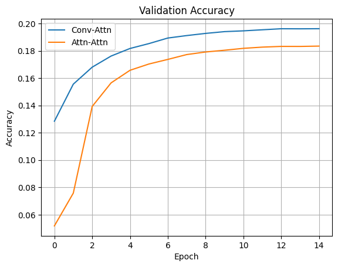
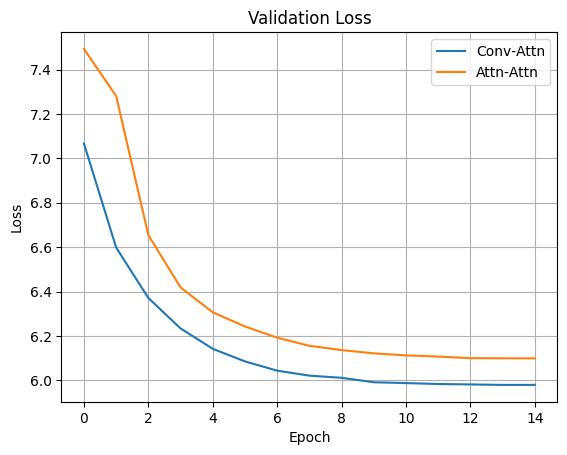
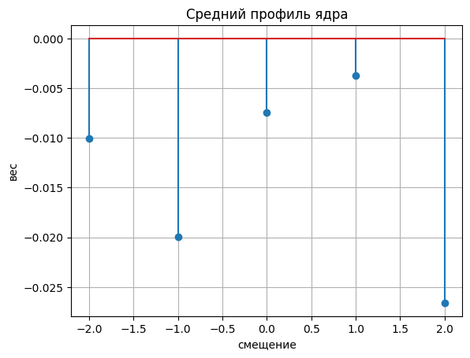
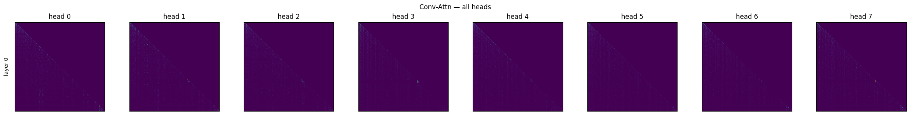

# HW1

## Необходимые библиотеки
- torch>=2.0.0
- transformers>=4.30.0
- datasets>=2.10.0
- tqdm>=4.64.0
- matplotlib>=3.5.0

В нуотбуке две модели:
* **Conv‑Attn** — Emb → Depth‑wise Conv(_k_=5) → Multi‑Head Attention → Lin
* **Attn‑Attn** — Emb → 4 × Multi‑Head Attention → Lin

Датасет — *Wikitext‑2‑raw‑v1*, предсказание следующего токена.

## 1. Постановка задачи  
Исследовать, насколько эффективно архитектуры на основе 
свёртки аппроксимируют поведение "smeared keys" и induction heads.

## 2. Архитектуры и гиперпараметры  

| Параметр | Conv‑Attn | Attn‑Attn |
|----------|-----------|-----------|
| `d_model` | 512 | 512 |
| Heads | 8 | 8 |
| Слои SDPA | 1 | 4 |
| Conv kernel | 5 | — |
| LR / sched | 3e‑4 / cosine + warmup 500 | то же |
| Batch / seq_len | 32 × 256 | то же |
| Epochs | 15 | 15 |

Сид = 42, оптимизатор — AdamW, grad‑clip = 1.0, AMP‑FP16.

## 3. Ход обучения

*Conv‑Attn* сходится быстрее и немного обгоняет *Attn‑Attn* по val‑accuracy

**Сложности**:  

1. Для Conv‑Attn kernel_size = 3 давал слишком «острый» фильтр — линия
   induction‑head почти исчезала; k = 5 исправило ситуацию.  
2. Градиенты Conv‑слоя взрывались — решил
   grad‑clip = 1.0.

## 4. Анализ весов Conv  

Максимальное (по модулю) значение по‑прежнему приходится на смещение −1.

Более плавный гауссов вид достигается при kernel_size ≥ 7 и/или после большего числа эпох; здесь модель уже демонстрирует смещение фокуса на t‑1, что подтверждает гипотезу smeared keys.

Отрицательный всплеск на +2 может означать, что модель явно подавляет информацию из будущего, создавая более чёткую каузальность.

### Conv‑Attn (все heads)

### Attn‑Attn (4 слоя × 8 голов)

*Наблюдения*  
* В Conv‑Attn полоса размыта (conv → усредняет ключи), что соответствует прогнозу "smeared keys".

## 6. Сравнение моделей  
| Модель | Final Loss | Final Acc |
|--------|-----------|-----------|
| Conv‑Attn | **5.98** | **0.196** |
| Attn‑Attn | 6.99 | 0.183 |

НConv‑Attn + Conv(k=5) достигает лучшей валид‑метрики и воспроизводит ожидаемое поведение.

## 7. Ограничения и дальнейшие шаги  
* Нет анализа длинных зависимостей (>256) — увеличить `seq_len`.  
* Проверить на TinyStories для коротких контекстов.

## 8. Заключение  
Depth‑wise Conv действительно реализует "размазывание" ключей и строит induction полосу без дополнительных SDPA‑слоёв. Однако точный head сдвига (Attn‑Attn) остаётся слегка точнее на «хвостах» распределения вероятностей; Кажется, будущее — за гибридными архитектурами Conv + Rotary + SDPA.
