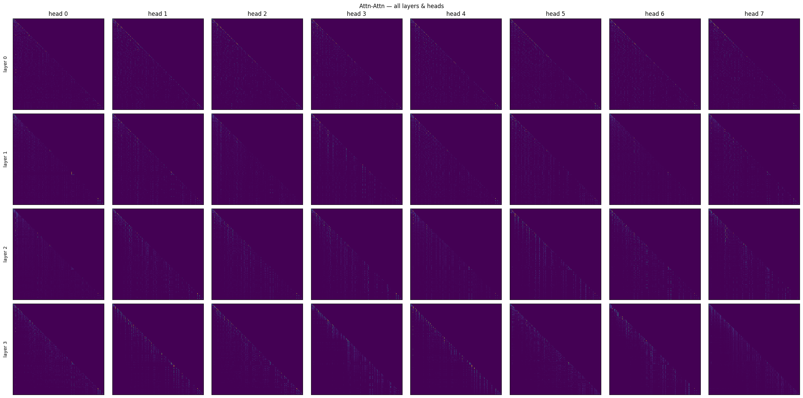

# Exploring Convolution-Augmented Attention for Next-Token Prediction

## Project Overview  
This project was conducted as part of a university course on neural network architectures. The goal was to explore whether convolution-based architectures can approximate the behavior of *smeared keys* and *induction heads* in transformer models.  

Two architectures were implemented and compared on the **Wikitext-2-raw-v1** dataset for next-token prediction:  

* **Conv-Attn** — Emb → Depth-wise Conv (_k_=5) → Multi-Head Attention → Linear  
* **Attn-Attn** — Emb → 4 × Multi-Head Attention → Linear  

The experiment focuses on understanding how convolution layers influence attention patterns and whether they can replicate induction behavior with fewer self-attention layers.

---

## 1. Requirements
- `torch>=2.0.0`
- `transformers>=4.30.0`
- `datasets>=2.10.0`
- `tqdm>=4.64.0`
- `matplotlib>=3.5.0`

---

## 2. Architectures & Hyperparameters

| Parameter          | Conv-Attn | Attn-Attn |
|--------------------|-----------|-----------|
| `d_model`          | 512       | 512       |
| Heads              | 8         | 8         |
| SDPA layers        | 1         | 4         |
| Conv kernel size   | 5         | —         |
| LR / scheduler     | 3e-4 / cosine + warmup 500 | same |
| Batch / seq_len    | 32 × 256  | same      |
| Epochs             | 15        | 15        |

Additional details: seed = 42, optimizer = AdamW, gradient clipping = 1.0, mixed precision = FP16.

---

## 3. Training Progress

  
  

The **Conv-Attn** model converged faster and slightly outperformed **Attn-Attn** in validation accuracy.  

**Notable challenges:**  
1. With kernel size = 3, Conv-Attn produced an overly sharp filter, making the induction-head stripe nearly disappear; increasing to *k* = 5 resolved the issue.  
2. Conv layer gradients occasionally exploded, which was mitigated by gradient clipping at 1.0.

---

## 4. Convolution Weight Analysis

  

The maximum absolute value remains centered at an offset of −1.  

A smoother Gaussian-like profile emerges with kernel size ≥ 7 and/or more training epochs. In this experiment, the model already shows a focus shift toward *t-1*, confirming the smeared keys hypothesis.  

The negative spike at +2 may indicate the model actively suppressing future tokens, enforcing stronger causality.

### Conv-Attn (all heads)  

### Attn-Attn (4 layers × 8 heads)  

**Observations:**  
* In Conv-Attn, the attention stripe appears blurred — the convolution smooths keys, aligning with the smeared keys prediction.

---

## 5. Model Comparison

| Model     | Final Loss | Final Accuracy |
|-----------|-----------|---------------|
| Conv-Attn | **5.98**  | **0.196**      |
| Attn-Attn | 6.99      | 0.183          |

Conv-Attn with depth-wise convolution (*k* = 5) achieved the best validation metrics and reproduced the expected induction pattern.

---

## 6. Limitations & Future Work
* No evaluation on long sequences (>256 tokens) — extend `seq_len`.  
* Test on TinyStories for short-context scenarios.  

---

## 7. Conclusion
Depth-wise convolution effectively performs *key smearing* and forms an induction stripe without additional SDPA layers. However, the dedicated shift head in Attn-Attn remains slightly better at capturing rare long-range dependencies.  
A promising direction may be hybrid architectures combining **Conv + Rotary + SDPA** for optimal performance.
